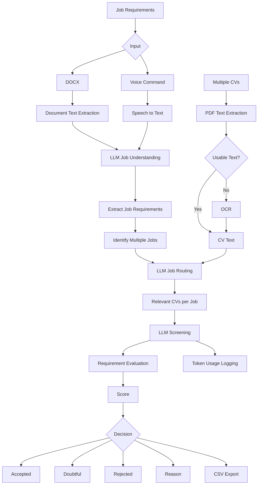

# CV Screening Vision LLM

An AI-powered CV screening system that evolved from a three-parameter resume evaluator into a **generic, multi-job, LLM-driven recruitment screening pipeline**.

The system can understand job requirements, process multiple CVs, identify relevant candidates for different jobs, evaluate candidates using LLM-based reasoning, and generate structured screening results with scores, decisions, and explanations.

> **Current development:** Version 7 is extending job-requirement input to support **voice commands** alongside DOCX input, while further improving the frontend.

---

## Overview

Traditional CV screening often relies on manually reviewing resumes or matching fixed keywords against predefined requirements. This project explores a more flexible approach using **Large Language Models (LLMs)** to understand both job requirements and candidate resumes.

The system has been developed iteratively, with each version addressing limitations discovered through testing and evaluation.

The project evolved from:

```text
Hardcoded Job Requirements
        ↓
Education + Experience + Skills
        ↓
CV Screening
        ↓
Accept / Reject
```

into:

```text
              Job Requirements
                /          \
             DOCX          Voice*
               ↓              ↓
               └──────┬───────┘
                      ↓
             LLM Job Understanding
                      ↓
                Job Extraction
                      ↓
               Job-Based Routing
                      ↓
                 CV Filtering
                      ↓
                LLM Screening
                      ↓
          Score + Decision + Reason
                      ↓
        Accepted / Doubtful / Rejected
                      ↓
                     CSV
```

`* Voice input is part of Version 7 development.`

---

# Key Features

### AI-Based CV Screening

Uses LLMs to understand resumes and evaluate candidates against job requirements rather than relying solely on exact keyword matching.

### Generic Job Requirements

The system is no longer restricted to a fixed set of screening fields. Job requirements can be expressed naturally and interpreted by the LLM.

### Multiple CV Processing

Multiple resumes can be submitted and processed as a batch.

### PDF and OCR Processing

The system attempts normal PDF text extraction first and can use OCR when usable text cannot be extracted from a CV.

### DOCX Job Requirements

Job requirements can be provided through a Word document rather than being restricted to predefined frontend fields.

### Multiple Jobs

A single job-requirement document can contain multiple job descriptions. The system can identify the different jobs and process them separately.

### LLM-Based Job Routing

CVs are first evaluated for relevance to the extracted jobs. Relevant CVs are then passed to the detailed screening stage.

This avoids treating every CV as a candidate for every available position.

### Explainable Decisions

Screening results include:

* Score
* Decision
* Reason

The system uses three decision categories:

|  Score | Decision |
| -----: | -------- |
| 80–100 | Accepted |
|  50–80 | Doubtful |
|   0–50 | Rejected |

### CSV Export

Screening results can be exported for further analysis and record keeping.

### Multi-Provider LLM Support

The system supports multiple LLM providers through a provider abstraction layer:

* Groq
* OpenRouter
* Google/Gemini

This allows the underlying provider/model to be changed without redesigning the complete screening pipeline.

### Token Usage Logging

LLM usage is tracked to support monitoring and evaluation of AI usage.

Logged information includes:

* Provider
* Model
* API key identifier
* Prompt tokens
* Completion tokens
* Total tokens
* Processing time

### Accuracy Evaluation

The system has been tested across different job areas and iteratively improved based on screening results and accuracy calculations.

### Voice Job Requirements — Version 7

Version 7 introduces voice as an additional way of providing job requirements.

The intended architecture is:

```text
DOCX ──────┐
           ├──→ Job Understanding → Job Extraction
Voice ─────┘
                         ↓
                    Job Routing
                         ↓
                    CV Screening
```

DOCX and voice input are intended to use the same downstream screening pipeline.

---

# System Architecture

## Current Pipeline



---

# Screening Process

The system uses a multi-stage pipeline rather than directly sending every CV to a single screening prompt.

### Stage 1 — Job Requirement Understanding

The job-requirement input is processed by the LLM.

The system determines what the document or voice input is asking for rather than requiring a rigid predefined syntax.

### Stage 2 — Job Extraction

If multiple jobs are present, the LLM identifies and separates the different job requirements.

For example:

```text
Job Requirements Document
          ↓
        LLM
          ↓
 ┌────────┼────────┐
 ↓        ↓        ↓
Job 1    Job 2    Job 3
```

### Stage 3 — CV Processing

Each CV is processed individually.

For PDF CVs:

```text
PDF
 ↓
Text Extraction
 ↓
Text available?
 ├── Yes → Continue
 └── No  → OCR → Continue
```

### Stage 4 — Job Routing

The system determines which extracted job or jobs are relevant to each CV.

```text
CVs
 ↓
LLM Relevance Analysis
 ↓
Job 1 → Relevant CVs
Job 2 → Relevant CVs
Job 3 → Relevant CVs
```

### Stage 5 — Detailed Screening

Relevant CV/job combinations are passed to the detailed screening process.

The LLM evaluates the candidate against the requirements of the relevant job.

The original screening system began with three major parameters:

* Education
* Experience
* Skills

The system was later generalized so that it could evaluate requirements beyond these three fixed categories when the job requires them.

### Stage 6 — Decision

The candidate receives:

* A numerical score
* A screening decision
* A concise reason

Possible decisions:

**Accepted**

The candidate sufficiently meets the requirements.

**Doubtful**

The candidate falls into a borderline or uncertain range and may require human review.

**Rejected**

The candidate does not sufficiently meet the requirements.

---

# LLM Provider Architecture

The backend uses a provider abstraction so that different LLM providers can be used through a common interface.

```text
                 Screening System
                       ↓
                 AI Provider Layer
                       ↓
        ┌──────────────┼──────────────┐
        ↓              ↓              ↓
      Groq         OpenRouter     Google/Gemini
```

This architecture makes it possible to change providers without rewriting the complete screening pipeline.

---

# Token Usage Monitoring

Token logging was introduced when the system moved to the DOCX-based job-requirement workflow.

The purpose is to monitor the computational/API cost of the LLM pipeline and compare provider/model usage.

Example tracked fields:

| Field              | Description                     |
| ------------------ | ------------------------------- |
| Provider           | LLM provider used               |
| Model              | Model used for the request      |
| API Key Identifier | Identifier for the API key used |
| Prompt Tokens      | Input tokens                    |
| Completion Tokens  | Output tokens                   |
| Total Tokens       | Total request tokens            |
| Processing Time    | Request processing duration     |

---

# Project Evolution

The system has been developed through multiple versions.

| Version | Date                | Major Development                                                        |
| ------- | ------------------- | ------------------------------------------------------------------------ |
| **V1**  | Jul 13, 2026        | Initial CV screening system                                              |
| **V2**  | Jul 16, 2026        | Generic/variable job requirements, improved structure and prompts        |
| **V3**  | Jul 21, 2026        | Doubtful category, multi-domain testing, prompt improvements             |
| **V4**  | Jul 28–Aug 3, 2026  | DOCX input, token logging, optimization, accuracy calculation            |
| **V5**  | Aug 9–12, 2026      | Multiple jobs, accuracy improvements, LLM-based job routing              |
| **V6**  | Aug 12, 2026        | UX Pilot frontend improvements and decision-making accuracy improvements |
| **V7**  | Current development | Voice job requirements and further frontend improvements                 |

### V1 — Initial System

The project began as a CV screening system based on three primary parameters:

1. Education
2. Experience
3. Skills

Multiple CVs were processed using PDF extraction/OCR and evaluated against hardcoded job requirements.

The initial output used an Accept/Reject decision and CSV export.

### V2 — Generic Job Requirements

The job requirements became variable rather than being permanently tied to one predefined role.

The project structure and screening prompts were also improved.

### V3 — Doubtful Category

A third decision category was introduced:

**Accepted / Doubtful / Rejected**

The system was tested with different job areas and the prompts were refined based on observed results.

### V4 — DOCX and Token Logging

Job requirements moved from individual frontend fields to a DOCX document.

The system was made capable of understanding requirements expressed using natural language and different document structures.

Token usage logging was also introduced.

The system was subsequently optimized and accuracy calculation was added.

### V5 — Multiple Jobs and Routing

The system was extended to handle multiple job descriptions within a single requirements document.

LLM-based job routing was introduced so that CVs could be associated with the appropriate job before detailed screening.

### V6 — Frontend and Accuracy Improvements

The frontend was redesigned/improved using UX Pilot.

Further work was performed to improve decision-making and overall screening accuracy.

### V7 — Voice Input and Frontend Enhancement

The next development stage introduces voice commands for providing job requirements.

DOCX remains supported.

The goal is for both input methods to feed into the same job-understanding, job-extraction, routing, and screening pipeline.

Further frontend improvements are also planned.

---

# Code Audit and Optimization

The system has also undergone a code audit using Claude.

The audit focused on reviewing the existing implementation and identifying opportunities for:

* Improved code organization
* Reduced redundancy
* Better maintainability
* More efficient processing
* Improved reliability
* Optimization of LLM/API usage
* Architectural improvements

The resulting optimizations are part of the ongoing development of the system.

---

# Technology Stack

## Backend

* Python
* FastAPI
* Pydantic
* Uvicorn

## Frontend

* React
* Vite
* JavaScript
* CSS

## AI / LLM

* Groq
* OpenRouter
* Google/Gemini

## Document Processing

* PDF text extraction
* OCR
* DOCX text extraction

## Communication

* REST API
* WebSocket for real-time screening updates

## Output

* CSV

---

# Project Structure

```text
CV-Screening-Vision-LLM/
│
├── backend/
│   ├── app/
│   │   ├── ai_provider.py
│   │   ├── config.py
│   │   ├── csv_export.py
│   │   ├── file_utils.py
│   │   ├── google_provider.py
│   │   ├── groq_provider.py
│   │   ├── job_requirements.py
│   │   ├── job_rules.py
│   │   ├── main.py
│   │   ├── openrouter_provider.py
│   │   ├── prompts.py
│   │   ├── providers_base.py
│   │   ├── resume_service.py
│   │   ├── schemas.py
│   │   └── screening.py
│   │
│   ├── requirements.txt
│   └── .env.example
│
├── frontend/
│   ├── src/
│   │   ├── components/
│   │   ├── hooks/
│   │   ├── styles/
│   │   ├── utils/
│   │   └── App.jsx
│   │
│   ├── index.html
│   ├── package.json
│   └── vite.config.js
│
└── README.md
```

---

# Installation

## Backend

```bash
cd backend

python -m venv .venv
```

### Windows PowerShell

```powershell
.\.venv\Scripts\Activate.ps1
```

### macOS / Linux

```bash
source .venv/bin/activate
```

Install dependencies:

```bash
pip install -r requirements.txt
```

Create the environment file:

```bash
cp .env.example .env
```

Configure the required API credentials in `.env`.

Example:

```env
AI_PROVIDER=groq
GROQ_API_KEY=your_api_key
```

Run the backend:

```bash
uvicorn app.main:app --reload --port 8000
```

Health check:

```text
http://localhost:8000/api/health
```

## Frontend

```bash
cd frontend
npm install
npm run dev
```

The development frontend is available at:

```text
http://localhost:5173
```

---

# Current Status

### Implemented

* Multiple CV processing
* PDF processing
* OCR fallback
* LLM-based CV understanding
* Generic job requirements
* DOCX job requirements
* Multiple job handling
* LLM-based job routing
* LLM-based candidate screening
* Accepted / Doubtful / Rejected classification
* Score and reason generation
* CSV output
* Multiple LLM providers
* Token usage logging
* Accuracy evaluation
* Frontend improvements

### Version 7 Development

* Voice-command job requirements
* Further frontend improvements

---

# Future Direction

The long-term goal is to make the system a flexible recruitment screening pipeline capable of understanding job requirements and candidate information without requiring rigid input formats.

Potential future improvements include:

* More robust voice interaction
* Improved multilingual input
* Better candidate-job relevance ranking
* More detailed evaluation metrics
* Provider/model performance comparison
* Improved explainability
* Human-in-the-loop review workflows
* More extensive automated testing
* Further optimization of LLM usage and processing time

---

## Development Philosophy

The system has been developed iteratively.

Each major version was created in response to limitations discovered during testing, rather than treating the first implementation as final.

The evolution can be summarized as:

```text
V1
Basic CV Screening
        ↓
V2
Generic Job Requirements
        ↓
V3
Uncertainty-Aware Decisions
        ↓
V4
Document-Based Requirements + Token Monitoring
        ↓
V5
Multi-Job Processing + LLM Routing
        ↓
V6
Accuracy + Frontend Improvements
        ↓
V7
Voice-Based Requirements + Further Frontend Enhancement
```

The project therefore represents not only an AI screening application, but an iterative exploration of **document understanding, LLM-based matching, multi-stage candidate routing, evaluation, and AI-system optimization**.
